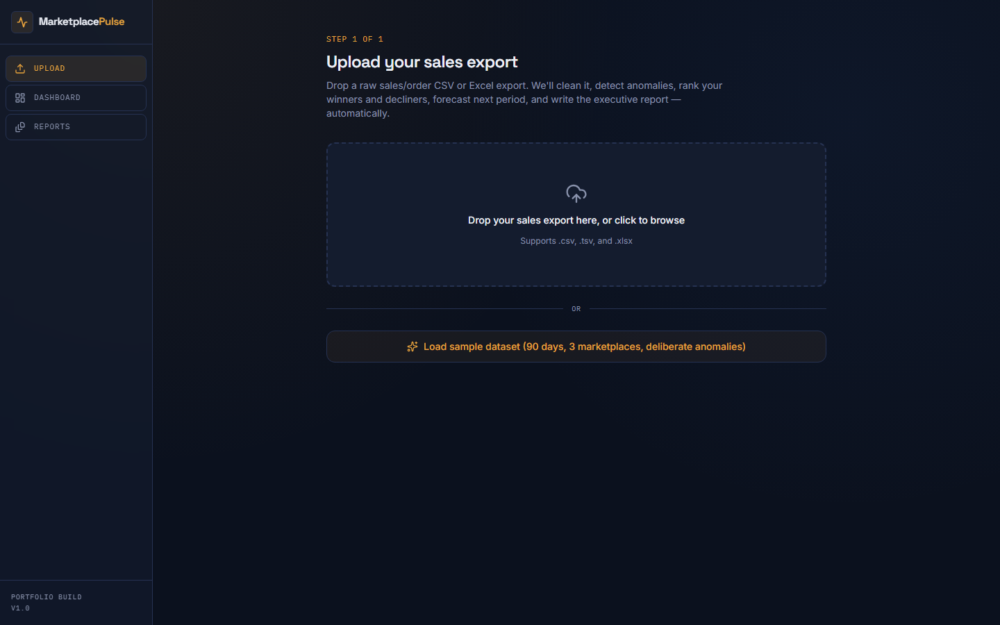
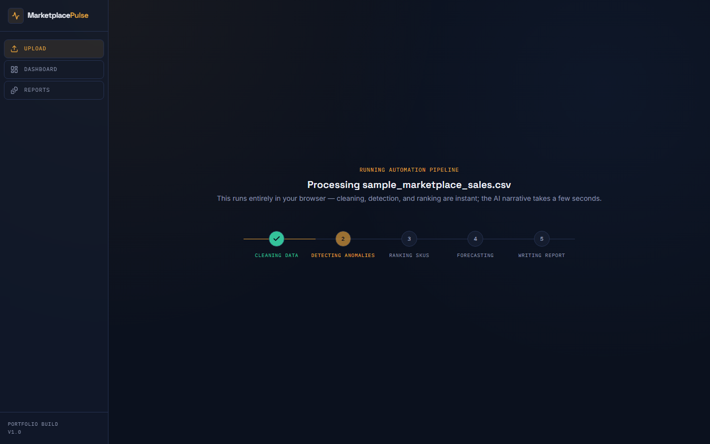
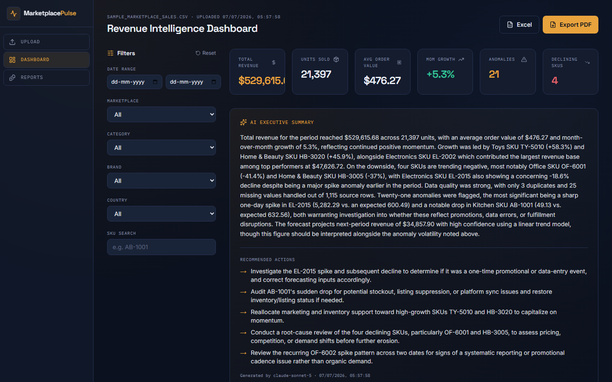
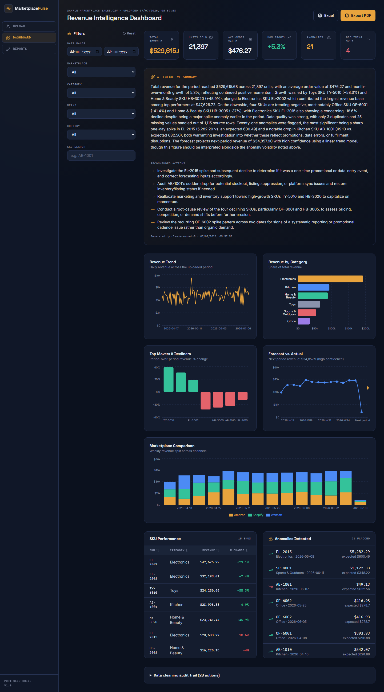

# Marketplace Pulse

**Sales & Revenue Intelligence + Auto-Reporting Engine.**

🔗 **[Live Demo](https://marketplace-pulse-theta.vercel.app/)** · **[Source on GitHub](https://github.com/PallavJaiswal/marketplace-pulse)**

Upload a raw sales/order export and Marketplace Pulse automatically cleans it, detects
anomalies, ranks your top and declining SKUs, forecasts next period's revenue, writes an
AI executive summary, and generates board-ready PDF and Excel reports — the full pipeline,
not just a dashboard.

```
Upload File → Clean Data → Detect Anomalies → Rank SKUs → Forecast → AI Narrative → Dashboard → Export
```

> **Latest update (Jul 2026):** Fixed the deployed AI narrative provider to correctly call
> **Groq** (it was pointed at xAI's Grok by mistake — different companies, easily confused
> names) and documented the dual-provider setup end to end: Claude for local dev, Groq for
> the public Vercel deployment, with a one-summary-per-visitor demo cap.

## Screenshots

**Upload & auto column-mapping**


**Live pipeline animation** (clean → detect → rank → forecast → report)


**Revenue Intelligence Dashboard** — KPIs + AI executive summary


<details>
<summary>Full dashboard (charts, SKU table, anomaly log)</summary>



</details>

## Features

- **Drag-and-drop upload** for CSV, TSV, or Excel (.xlsx) sales exports, with a column-mapper
  that auto-detects your headers.
- **Auditable data cleaning** — normalizes dates/currency, imputes missing units/revenue from
  category medians, dedupes exact duplicates, and logs every change (nothing is a black box).
- **Statistical anomaly detection** — per-SKU rolling z-score flags genuine spikes/drops.
- **Top mover & decliner ranking** — period-over-period revenue comparison per SKU.
- **Revenue forecasting** — linear-trend/moving-average forecast for next period.
- **AI-written executive summary** — a server-side call turns the aggregated results into a
  4-6 sentence narrative plus concrete recommendations. Provider auto-switches by environment:
  Claude locally, Groq on the deployed/public site (see **AI Narrative Provider** below).
- **Interactive dashboard** — 6 KPI cards, 5 charts (Recharts), filterable/sortable SKU table,
  anomaly log, and a live functional filter sidebar (date range, marketplace, category, brand,
  country, SKU search).
- **One-click exports** — a multi-tab Excel workbook (summary, cleaned data, anomaly log, SKU
  performance, cleaning log) and a polished, multi-page PDF executive report with embedded
  chart images.
- **Report history** — every processed file is saved locally (last 5 runs) so you can revisit
  and re-export past reports.
- **Sample dataset button** — generates a realistic 90-day, 3-marketplace dataset with a
  deliberate spike, a deliberate drop, a genuinely declining SKU, and messy rows — so the whole
  pipeline can be demoed instantly without a real file.

## Tech Stack

Next.js 14 (App Router) · TypeScript · Tailwind CSS v4 · Recharts · papaparse · SheetJS (xlsx)
· jsPDF + jspdf-autotable · html2canvas · Claude API (Anthropic, local dev) · Groq API
(deployed)

No database is required for the MVP — all processing happens client-side in the browser, and
report history is kept in `localStorage`. This keeps setup to "install and run" with nothing
to provision. See **Roadmap** below for how to add Supabase for multi-user persistence.

## Getting Started

```bash
npm install
cp .env.example .env.local
# then add your Anthropic (Claude) API key to .env.local
npm run dev
```

Open [http://localhost:3000](http://localhost:3000) — it redirects straight to `/upload`.

Click **"Load sample dataset"** to try the full pipeline immediately without any file of your
own.

### AI Narrative Provider

`/api/narrative` auto-detects which provider to call — nothing to switch by hand:

- **Local (`npm run dev`)** → calls **Claude**, using `ANTHROPIC_API_KEY` from `.env.local`.
- **Deployed on Vercel** (Vercel sets `VERCEL=1` automatically) → calls **Groq** instead, using
  `GROQ_API_KEY`. This keeps the Claude key entirely off the public deployment.
- The deployed/Groq path is capped at **one AI summary per visitor** via a simple cookie
  (`mp_demo_used`), so the public demo can't run up API costs — clearing cookies or an
  incognito window resets it, which is an accepted tradeoff for a portfolio demo. Nothing else
  in the app (dashboard, charts, exports) is limited.
- `NARRATIVE_PROVIDER=claude` or `NARRATIVE_PROVIDER=groq` can force a specific provider if you
  ever need to override the auto-detection.

> Note: **Groq** (`console.groq.com`, fast open-model inference) and **xAI's Grok**
> (`console.x.ai`) are two different companies with easily-confused names — this project uses
> Groq.

### Environment Variables

| Variable | Required | Description |
|---|---|---|
| `ANTHROPIC_API_KEY` | Local dev only | Server-side only — used by `/api/narrative` when running locally. Get one at [console.anthropic.com](https://console.anthropic.com/settings/keys). Never add this in Vercel. |
| `CLAUDE_NARRATIVE_MODEL` | No | Overrides the Claude model used locally. Defaults to `claude-sonnet-5`. |
| `GROQ_API_KEY` | Deployed (Vercel) only | Server-side only — used by `/api/narrative` on the deployed site. Get one at [console.groq.com](https://console.groq.com/). Not needed locally. |
| `GROQ_MODEL` | No | Overrides the Groq model used when deployed. Defaults to `llama-3.3-70b-versatile`. |
| `NARRATIVE_PROVIDER` | No | Forces `"claude"` or `"groq"` instead of auto-detecting. Leave unset for normal use. |

Without the relevant key configured, the rest of the pipeline still works — the AI summary
card just explains it's not configured (or, on the deployed site, that the one-per-visitor
demo limit was reached).

## Deploying for Free

1. Push this project to a GitHub repo.
2. Import it into [Vercel](https://vercel.com/new) (free tier is plenty for a demo).
3. Add the `GROQ_API_KEY` environment variable in the Vercel project settings, scoped to
   Production. **Do not** add `ANTHROPIC_API_KEY` in Vercel — it should only ever exist in your
   local `.env.local`, keeping it off the public deployment entirely.
4. Deploy — you'll get a live URL you can share or demo directly in an interview.

## Project Structure

```
marketplace-pulse/
├── app/
│   ├── upload/page.tsx          # Upload, column mapping, sample data, pipeline trigger
│   ├── dashboard/page.tsx       # KPIs, AI summary, charts, filters, tables, export
│   ├── reports/page.tsx         # Report history
│   ├── api/narrative/route.ts   # Server-side AI call — Claude locally, Groq when deployed
│   └── layout.tsx               # Fonts, design tokens, nav shell
├── components/
│   ├── charts/                  # RevenueTrend, CategoryShare, TopDeclining, Forecast, MarketplaceComparison
│   ├── FileDropZone.tsx, ColumnMapper.tsx, ProcessingSteps.tsx
│   ├── KpiCard.tsx, ExecutiveSummaryCard.tsx, FiltersSidebar.tsx
│   ├── PerformanceTable.tsx, AnomalyList.tsx, ReportCard.tsx
│   └── NavRail.tsx
├── lib/
│   ├── parsing.ts        # CSV/XLSX parsing
│   ├── cleaning.ts        # Data cleaning + audit trail
│   ├── anomalyDetection.ts  # Rolling z-score anomaly detection
│   ├── performance.ts     # Top/declining SKU ranking
│   ├── forecasting.ts     # Linear-trend forecasting
│   ├── kpis.ts / filters.ts
│   ├── claude.ts          # Client-side call to /api/narrative (provider-agnostic)
│   ├── exportExcel.ts / exportPdf.ts / captureChart.ts
│   ├── sampleData.ts      # Realistic demo dataset generator
│   ├── store.tsx          # React context orchestrating the full pipeline
│   └── types.ts
└── .env.example
```

## Design

A dark "instrument panel" system — deep navy base, a signature signal-amber accent (the
"pulse"), with Space Grotesk for display/numerals, Inter for body text, and IBM Plex Mono for
data labels. The processing screen's animated pulse bar is the signature element: it makes the
five-stage automation chain (clean → detect → rank → forecast → report) visible and literal,
not just a spinner.

## How This Fits a Portfolio

This is one of four related internal-tool builds (Inventory, Catalog, Sales/Reporting, and
Pricing) designed to demonstrate real e-commerce/marketplace operations expertise — see the
companion planning docs (`portfolio.md` and `portfolio-top4-blueprints.md`) for the other
three and how to present all four together.

**Suggested interview flow:** load the sample dataset live, narrate each pipeline stage as it
runs, land on the AI-written executive summary, then click "Export PDF" to show the finished
report. Emphasize that the cleaning step is auditable (open the "Data cleaning audit trail" on
the dashboard) — it's AI-assisted, not a black box.

## Roadmap

- **V2:** Scheduled recurring reports (cron + email delivery), multi-file historical trend
  tracking across uploads, a "chat with this report" interface powered by Claude.
- **V3:** Supabase for multi-user accounts and persistent server-side storage (replacing
  localStorage), multi-source blending (ad spend, returns) for full P&L-style reporting,
  white-label reports for agencies managing multiple seller accounts.
